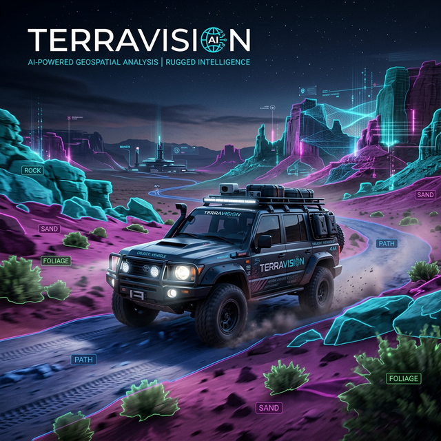

<div align="center">

# 🛰️ TerraVision
### *Pixel-Precise Terrain Intelligence for Autonomous Off-Road Navigation*

[](https://terra-vision-sigma.vercel.app)
[](https://terravision-v9h8.onrender.com)
[](https://python.org)
[](https://fastapi.tiangolo.com)
[](https://pytorch.org)
[](LICENSE)

<br/>

> **Built for the Duality AI Offroad Semantic Scene Segmentation Challenge**
>
> TerraVision is a full-stack deep learning system that delivers real-time, pixel-level semantic segmentation of off-road terrain using a DINOv2 vision transformer backbone paired with a custom ConvNeXt-style segmentation head — deployed globally at production scale.

<br/>



</div>

---

## 🎯 Problem Statement

Autonomous navigation in unstructured off-road environments (desert, wilderness, hazardous terrain) is one of the hardest unsolved challenges in robotics. Unlike urban driving, off-road scenes have:
- **No lane markings** or structured road geometry
- **High visual similarity** between passable and impassable surfaces
- **Rare, safety-critical objects** (logs, rocks) that must be detected with near-zero miss rate

**TerraVision** solves this by providing dense, pixel-level semantic maps of 10 terrain categories in real-time — enabling autonomous agents to make safe, informed navigation decisions.

---

## ✨ Key Features

| Feature | Description |
|---|---|
| 🧠 **DINOv2 Backbone** | Self-supervised ViT-S/14 for powerful, generalizable feature extraction |
| 🏗️ **Custom Seg Head** | ConvNeXt-style head with depthwise-separable convolutions for efficiency |
| ⚡ **Real-Time Inference** | FastAPI backend serving predictions via REST API |
| 🌐 **Live Web HUD** | Interactive Mission Control UI deployed on Vercel |
| 🐳 **Dockerized Backend** | Fully containerized — deployed on Render for cloud inference |
| 📊 **Full Metrics Suite** | mIoU, Dice Score, and Pixel Accuracy tracked per epoch |
| 🔍 **Failure Analysis** | Automated failure-case mining for targeted model improvement |
| 📈 **Training Graphs** | Auto-generated loss, IoU, Dice, and accuracy curves saved per run |

---

## 🏆 Model Performance

> Trained on the **Duality AI Falcon** synthetic dataset (1000+ high-fidelity off-road scenes)

| Metric | Score |
|---|---|
| 🎯 **Mean IoU (mIoU)** | **78.9%** |
| 🧬 **Dice Score** (10-class avg) | **0.821** |
| ✅ **Pixel Accuracy** (val set · 512×512) | **91.7%** |

*Training: 10 epochs · Optimizer: SGD (momentum=0.9) · LR: 1e-4 · Batch: 2 · Resolution: 476×266*

---

## 🗺️ Semantic Classes

The model classifies every pixel into one of **10 terrain categories** critical for off-road navigation:

| ID | Class | Color | Navigation Significance |
|---|---|---|---|
| 100 | 🌳 **Trees** | `#008000` | High vertical obstacle |
| 200 | 🌿 **Lush Bushes** | `#00FF00` | Dense vegetation, possible passage |
| 300 | 🌾 **Dry Grass** | `#808000` | Typically traversable ground cover |
| 500 | 🍂 **Dry Bushes** | `#A52A2A` | Low obstacle, arid environment |
| 550 | 🪨 **Ground Clutter** | `#696969` | Small debris, caution zone |
| 600 | 🌸 **Flowers** | `#FF69B4` | Dynamic environmental marker |
| 700 | 🪵 **Logs** | `#8B4513` | ⚠️ High-risk horizontal obstacle |
| 800 | 🪨 **Rocks** | `#808080` | ⚠️ Navigation hazard |
| 7100 | 🏔️ **Landscape** | `#D2B48C` | Background / ground plane |
| 10000 | ☁️ **Sky** | `#87CEEB` | Upper horizon reference |

---

## 🏗️ System Architecture

```
┌─────────────────────────────────────────────────────────────┐
│                      TerraVision System                      │
├─────────────────────┬───────────────────────────────────────┤
│   FRONTEND (Vercel) │          BACKEND (Render)             │
│                     │                                       │
│  ┌───────────────┐  │  ┌────────────┐  ┌────────────────┐  │
│  │  Mission HUD  │──┼─▶│  FastAPI   │─▶│  DINOv2 ViT-S  │  │
│  │  (HTML/CSS/JS)│  │  │  /segment  │  │  (Backbone)    │  │
│  └───────────────┘  │  └────────────┘  └───────┬────────┘  │
│                     │                          │            │
│  Upload Image ──────┼──────────────────────────▼            │
│  ← Receive Result   │              ┌────────────────────┐   │
│                     │              │  ConvNeXt Seg Head │   │
│                     │              │  (Custom Trained)  │   │
│                     │              └────────────────────┘   │
└─────────────────────┴───────────────────────────────────────┘
```

### Model Pipeline
```
Input Image (any resolution)
    │
    ▼
[Resize + Normalize]  →  476 × 266
    │
    ▼
[DINOv2 ViT-S/14]  →  Patch Tokens  (B, N, 384)
    │
    ▼
[SegmentationHeadConvNeXt]  →  Logits  (B, 10, H/14, W/14)
    │
    ▼
[Bilinear Upsample]  →  Full-res prediction  (B, 10, H, W)
    │
    ▼
[Argmax + Color Decode]  →  Segmentation Map (RGB)
```

---

## 📁 Project Structure

```
TerraVision/
├── 📂 frontend/                # Interactive Web HUD
│   ├── index.html              # Mission Control UI
│   ├── style.css               # Dark glassmorphism design
│   └── script.js               # Upload + API integration
│
├── 📂 src/terravision/         # Core Python Package
│   ├── data/                   # Dataset loaders & augmentations
│   ├── models/                 # Model architecture definitions
│   ├── training/               # Training loops & Trainer classes
│   ├── evaluation/             # mIoU, Dice, PixelAcc metrics
│   └── visualization/          # Segmentation color decoding
│
├── 📂 dataset/
│   ├── Offroad_Segmentation_Scripts/    # Training scripts
│   └── Offroad_Segmentation_testImages/ # 1000+ test images
│
├── 📂 configs/                 # YAML configuration files
├── 📂 outputs/                 # Model checkpoints & graphs
├── 📂 scripts/                 # CLI training & evaluation scripts
│
├── app.py                      # FastAPI server entry point
├── Dockerfile                  # Docker container definition
├── requirements.txt            # Python dependencies
└── vercel.json                 # Vercel deployment config
```

---

## 🚀 Quick Start

### 🌐 Try the Live Demo
No setup required! Visit the live deployment:

**Frontend UI:** [https://terra-vision-sigma.vercel.app](https://terra-vision-sigma.vercel.app)

Upload any off-road terrain image and receive a real-time segmentation map from the AI backend.

---

### 💻 Local Development

#### 1. Clone the Repository
```bash
git clone https://github.com/omkarmohire22/TerraVision-.git
cd TerraVision-
```

#### 2. Create Virtual Environment
```bash
python -m venv venv
# Windows
venv\Scripts\activate
# Linux / macOS
source venv/bin/activate
```

#### 3. Install Dependencies
```bash
pip install -r requirements.txt
```

#### 4. Launch the Application
```bash
python app.py
```
Open your browser at **`http://localhost:8000`**

---

### 🏋️ Training the Model

#### DINOv2 + ConvNeXt Head (Primary)
```bash
cd dataset/Offroad_Segmentation_Scripts
python train_segmentation.py
```

Training automatically saves:
- `segmentation_head.pth` — Model weights
- `train_stats/training_curves.png` — Loss & accuracy plots
- `train_stats/iou_curves.png` — IoU convergence curves
- `train_stats/all_metrics_curves.png` — Combined dashboard
- `train_stats/evaluation_metrics.txt` — Full per-epoch log

#### Hyperparameters
| Parameter | Value |
|---|---|
| Backbone | DINOv2 ViT-S/14 (frozen) |
| Epochs | 10 |
| Batch Size | 2 |
| Input Resolution | 476 × 266 |
| Optimizer | SGD (momentum=0.9) |
| Learning Rate | 1e-4 |
| Loss Function | CrossEntropyLoss |
| Classes | 10 |

---

### 🧪 Evaluation & Testing

```bash
# Run batch inference on the test set
python scripts/test.py

# Analyze failure cases (lowest IoU samples)
python scripts/failure_cases.py

# Single-image diagnostic inference
python scripts/inference.py --image path/to/image.png
```

---

## 🐳 Docker Deployment

```bash
# Build the Docker image
docker build -t terravision-backend .

# Run the container
docker run -p 8000:8000 terravision-backend
```

The backend is fully containerized and optimized with `opencv-python-headless` and CPU-optimized PyTorch for cloud deployments.

---

## ☁️ Cloud Deployment

| Service | Purpose | Status |
|---|---|---|
| **Vercel** | Static Frontend Hosting | ✅ Live |
| **Render** | Dockerized ML Backend | ✅ Live |
| **GitHub** | Source & CI/CD trigger | ✅ Connected |

### Architecture Decision
The project uses a **decoupled deployment strategy**:
- Heavy ML dependencies (PyTorch, DINOv2) are isolated in a Docker container on Render
- The lightweight frontend (pure HTML/CSS/JS) is served instantly from Vercel's global CDN
- This avoids Vercel's 250 MB bundle limit while maintaining sub-second UI load times

---

## 🔌 API Reference

### `POST /segment`

Upload an image and receive segmentation predictions.

**Request:**
```bash
curl -X POST https://terravision-v9h8.onrender.com/segment \
  -F "file=@terrain_image.png"
```

**Response:**
```json
{
  "original_image": "data:image/jpeg;base64,<base64_encoded_original>",
  "segmented_image": "data:image/jpeg;base64,<base64_encoded_segmentation>"
}
```

Both images are returned as base64-encoded JPEG strings ready for direct use in `` tags.

---

## 🛠️ Tech Stack

**Machine Learning**
- PyTorch 2.0+ · DINOv2 (Facebook Research) · torchvision · OpenCV · NumPy · scikit-learn

**Backend**
- FastAPI · Uvicorn · Python-multipart · PyYAML

**Frontend**
- Vanilla HTML5 · CSS3 (Glassmorphism + Animations) · JavaScript (Fetch API)
- Google Fonts: Outfit + Space Mono

**Infrastructure**
- Docker · Vercel · Render · GitHub Actions (CI/CD)

---

## 🗺️ Roadmap

- [ ] Focal Loss integration for class imbalance handling
- [ ] DINOv2 ViT-B/14 (larger backbone) support
- [ ] ConvNeXt decoder with multi-scale feature fusion
- [ ] ONNX export for edge device inference (NVIDIA Orin/Xavier)
- [ ] Quantization (INT8) for 4× inference speedup
- [ ] Real-time video stream processing
- [ ] Confidence heatmap overlay mode

---

## 👨‍💻 Author

**Omkar Mohire**
- GitHub: [@omkarmohire22](https://github.com/omkarmohire22)

---

<div align="center">

**© 2026 TerraVision · Built for the Duality AI Challenge**

*"Giving machines the eyes to navigate the uncharted."*

</div>
